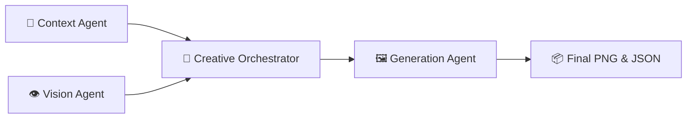

# 🌸 FNP Premium Ad Automation Showcase

This document is designed to be imported directly into Notion. It showcases the AI-driven pipeline that generates campaign-ready luxury advertisements for Ferns N Petals (FNP).

---

## 📸 Campaign Showcase: Mother's Day

Below are the two premium ad campaigns generated entirely by AI from raw bouquet images.

### Campaign 1: The Eternal Heart Bloom


*Original Product Image*


*AI-Generated Campaign Asset*

> **Tagline:** "The First Bloom of Every Love."
> **Headline:** "Celebrate Mother's Day with an eternal heart of exquisite roses."

### Campaign 2: The Rose Heart of Devotion


*Original Product Image*


*AI-Generated Campaign Asset*

> **Tagline:** "Her Heart, Your Truest Bloom."
> **Headline:** "An opulent heart of roses, honoring her unparalleled love this Mother's Day."

---

## 🏗️ Architecture Overview

The pipeline uses a **Multi-Agent Architecture** powered by Google's Gemini models (`gemini-2.5-flash` for reasoning/vision, `gemini-2.5-flash-image` for image generation) and Pillow for typography/compositing.



1. **Context Agent (Event Intelligence):** Looks at today's date and identifies the most commercially relevant upcoming "High-Value Gifting Event" (e.g., Mother's Day).
2. **Vision Agent (Product Analyzer):** Uses Gemini Multimodal to visually analyze the raw bouquet, extracting flower types, colors, style, and mood.
3. **Creative Orchestrator (Director Agent):** The "brain" of the pipeline. It merges the event + product + a predefined "Luxury Archetype" to craft a highly specific creative brief.
4. **Generation Agent (Asset Producer):** Uses Gemini's native image generation to create the visual background, then uses Python Pillow to composite the FNP logo, gradient overlays, and luxury typography.

---

## 🧠 Behind the Scenes: The Prompts

Here is a look at the system prompts that power the individual agents.

### 1. Event Intelligence Prompt (Context Agent)
This prompt ensures the AI understands the commercial urgency of Indian/Global gifting events.

```text
You are an event intelligence system for FNP (Ferns N Petals), India's leading premium flower and gifting brand.

Today's date is: [Current Date]

TASK: Identify the single most commercially relevant "High-Value Gifting Event" occurring within the NEXT 30 days.

Consider these events:
- Mother's Day (2nd Sunday of May)
- Father's Day (3rd Sunday of June)  
- Valentine's Day (February 14)
- Diwali (varies)
...
Respond ONLY with valid JSON in this exact format...
```

### 2. Vision Analysis Prompt (Vision Agent)
This prompt forces the AI to look at the product through the lens of a luxury art director.

```text
You are a luxury floral art director at FNP (Ferns N Petals), India's premium gifting brand.

Analyze this bouquet/flower product image in detail.

Respond ONLY with valid JSON in this exact format:
{
    "flower_types": ["Pink Carnations", "Baby's Breath"],
    "dominant_colors": ["#FFB6C1", "#FFFFFF"],
    "color_names": ["Soft Pink", "Pure White"],
    "arrangement_style": "Rounded hand-tied bouquet...",
    "price_tier": "Premium",
    "mood": "Gentle, nurturing, soft elegance...",
    "suggested_occasions": ["Mother's Day", "Birthday"],
    "product_summary": "An elegant hand-tied bouquet..."
}
```

### 3. Creative Direction Prompt (Creative Orchestrator)
This prompt dynamically shifts based on the "Luxury Archetype" of the detected event (e.g., Mother's Day = *maternal elegance*, Valentine's = *candlelit velvet*).

```text
You are a world-class creative director at FNP (Ferns N Petals), crafting a LUXURY OCCASION AD — not just a product ad.

═══ EVENT CONTEXT ═══
Event: Mother's Day
Date: 2026-05-10
Target Emotion: Gratitude, warmth, maternal love

═══ PRODUCT ANALYSIS ═══
Flowers: Red Roses
Style: Luxurious heart-shaped arrangement

═══ LUXURY ARCHETYPE DIRECTION ═══
Mood: Warm, ethereal, maternal elegance, soft sunlight
Lighting: Golden hour, warm diffused light through sheer curtains

═══ YOUR TASK ═══
Create a campaign-ready creative brief that makes this a LUXURY OCCASION AD.
The visual should feel like it belongs in Vogue or a Hermès campaign — not a product catalog.

Respond ONLY with valid JSON (image_prompt, tagline, sub_headline...)
```

---

## 🎨 Design Tokens & Text Overlay

Once the image is generated by Gemini, the **Pillow** library takes over to apply the final polish:

- **Logo Compositing:** The FNP transparent logo is dynamically scaled to exactly 15% of the ad width and placed with alpha-blending in the top-right corner.
- **Gradient Bar:** A frosted-glass/dark gradient is applied to the bottom 30% of the image to ensure the text is always legible regardless of the generated background.
- **Typography:** Premium serif fonts (e.g., Playfair Display/Georgia) are used, complete with drop-shadows and archetype-specific hex colors (e.g., warm cream for Mother's Day, gold for Diwali).

---
*Generated by the FNP Premium Ad Automation Pipeline*
